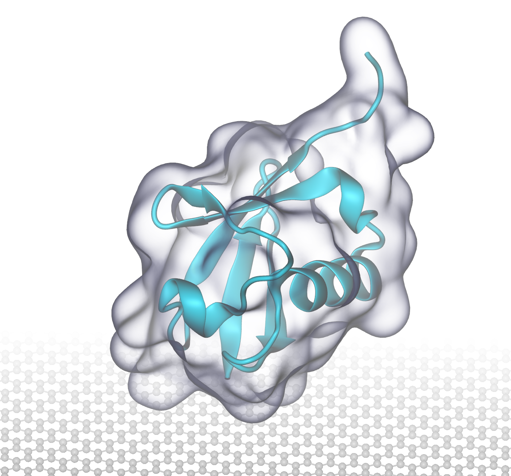

# Preface
This page is transplanted from a former wiki page. As for today, there are still a considerable amount of visits to that (abandoned) wiki page, hopefully this Github page will serve those visitors well as an update-to-date mini tutorial on how to make images for publication using VMD. Basically, this will be achieved by using Tachyon rendering, but I will also introduce tricks to sometimes skip the costly Tachyon rendering while achieving good enough images. 

After 7 years, I would definitely say that I am still an active learner on rendering good images for biomolecules. Again, feel free to contact me through Github about your thoughts on this page. Any discussion will be greatly appreciated. 

--Kevin 21:41, 4 May 2021 (HKT)

>I am also attending the journey of learning to render good images. So currently I could only provide you some useful links and my way of rendering. Please feel free to come to discuss with me or edit this page if you have a better way out. --Kevin 19:41, 14 May 2014 (HKT)

# Before you start
There are some very useful (but also limited) resources online to get yourself ready for the upcoming tedious artworks:
1. Official VMD website on Tachyon Rendering [Here](https://www.ks.uiuc.edu/Research/vmd/minitutorials/tachyonao)
2. "Rendering with Tachyon: a practical guide" by Aksimentiev Group @UIUC [PDF Here](tachyonTutorial.pdf)
3. Some mailing list discussion: [1][1], [2][2]

[1]: http://www.ks.uiuc.edu/Research/vmd/mailing_list/vmd-l/11356.html
[2]: http://www.ks.uiuc.edu/Research/vmd/mailing_list/vmd-l/17145.html

# The quick and dirty way
None likes long manuals, so I provide you here the easiest way to go:
1. (Optional) Change your background to white. `Graphics > Color > Categories:Display > Names:Background > 8 white`
2. (Optional) `Display > Orthographic`
3. (Optional) `Display > Axes > Off`
4. `Display > uncheck Light 1`
5. `Display > Display Settings > Amb. Occl. > On`
6. `Display > Display Settings > AO Ambient > 0.5`
7. `Display > Display Settings > AO Direct > 0.5`
8. `Graphics > Representations > Material > AOShiny`
9. `File > Render > using Tachyon (internal, in-memory rendering) > Browse /where/you/want/to/put/the/images > Start Rendering`

Hola, you might have already got an image a little bit better than the by default Snapshot rendering. Note that the real trick here is (1) turning on Amb. Occl. in Display Settings and (2) changing the Material of your molecules to AOShiny. These steps are essential for a proper Tachyon rendering. In the following sections, we will discuss in details what parameters are available in VMD for Tachyon rendering.

Some additonal steps especially for rendering images involving transparent molecules are introduced here: 
1. `Graphics > Representations > Drawing Method > QuickSurf`
2. `Graphics > Representations > Material > BlownGlass`
3. `Display > Rendermode > GLSL`
4. `File > Render > using Snapshot > Browse /where/you/want/to/put/the/images > Start Rendering`

I found that BlownGlass under GLSL looks pretty nice so one can easily skip the Tachyon rendering, which is especially costly when dealing with transparent surfaces, and directly producing images with cheap Snapshots. 

 
